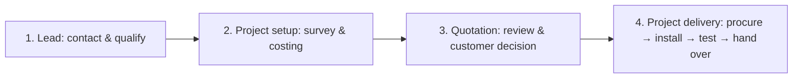

# Sarathi workflow guidance

## Proposed experience and implementation

The business journey is **Lead → Quotation → Project delivery**. As agreed, the existing data workflow stays intact: converting a lead creates the customer-linked project used for survey and costing **before** a quotation exists. Approval continues delivery in that same project; it does not create another project.

The implemented diagram therefore has four visible steps:



- **Lifecycle diagram:** dashboard, quotation list, guide and detail pages; current focus is marked with text and `aria-current`, without pretending earlier stages were completed.
- **Details:** `/admin/leads/[id]`, `/admin/quotes/[id]` and `/admin/projects/[id]` show bounded, authorized record data, linked records, usual previous steps, suggested next steps and recorded activity. Lead and quotation names link to them; project view controls open the full page.
- **Stage help:** keyboard-, pointer- and touch-accessible explanations. Tooltips render outside table overflow, stay within the viewport and close with Escape or an outside tap.
- **Activity:** latest 50 saved events, newest first, displayed in IST. Creation dates, saved quotation timestamps and project stage/hold history are used. Actor and reason appear when recorded. Historical lead status changes and missing quotation decision timestamps are not invented. Up to 10 recent related quotations are linked.
- **How it works:** `/admin/how-it-works`, available to every active workspace role, explains the flow, roles, all stages, exceptions and a CCTV example.
- **Introduction:** a short four-step modal on the first authenticated workspace visit after rollout. Skip, Back, Next, Escape and replay are supported. Completion/skip is saved for the authenticated account, across browsers. A failed save stays visible with Retry-by-clicking-again and Close for this visit; it never pretends persistence succeeded.

The guide explicitly states which actions are available. The quotation pages currently display existing records; creating, editing, issuing or sending quotations is not implemented by this UX work. Survey uploads, payment entry and hold management also remain outside this release. Suggested steps are guidance, not new workflow enforcement. Admin/operator controls follow existing permissions; viewers receive reading and navigation guidance.

## Small reusable components

Source: `operations/src/components/workflow/`. Shared text and stage maps live in `operations/src/lib/workflow.ts`; the server-only data reader is `operations/src/server/workflow.ts`.

```tsx
import { LifecycleDiagram } from "@/components/workflow/lifecycle-diagram";
import { StageTooltip } from "@/components/workflow/stage-tooltip";
import { StepPanel } from "@/components/workflow/step-panel";
import { ActivityTimeline } from "@/components/workflow/activity-timeline";
import type { ActivityEvent } from "@/lib/workflow";

// Supply events from the authorized server reader, never synthetic production history.
export function ProjectGuidance({ events }: { events: ActivityEvent[] }) {
  return (
    <>
      <LifecycleDiagram current="quote" />
      <StageTooltip kind="project" status="COSTING" />
      <StepPanel kind="project" status="COSTING" role="OPERATOR" />
      <ActivityTimeline events={events} />
    </>
  );
}
```

`StageTooltip` and `OnboardingTour` are small Client Components. The diagram, step panel, timeline and detail reader render on the server by default. All database access authorizes independently. The onboarding endpoint ignores caller-supplied user IDs, requires the exact trusted origin and updates only the signed-in active actor.

Styling uses pinned Tailwind/PostCSS build dependencies, `tw:`-prefixed utilities and existing theme tokens. Preflight is omitted to preserve the current admin/public styles. Setup follows the official [Next.js integration](https://tailwindcss.com/docs/installation/framework-guides/nextjs) and [selective imports without Preflight](https://tailwindcss.com/docs/preflight). No tour, diagram or timeline package is added.

## Stage meanings

| Area      | Normal progression                                                                                                                 | Exceptions                                                                                                                           |
| --------- | ---------------------------------------------------------------------------------------------------------------------------------- | ------------------------------------------------------------------------------------------------------------------------------------ |
| Lead      | New enquiry → Contacted → Qualified → Converted                                                                                    | Lost: no progression until reviewed/reopened. Converted means project setup, not quote approval.                                     |
| Quotation | Draft → Sent → Approved                                                                                                            | Declined: discuss a revision; Superseded: find the newer version; Void: withdrawn. Issued records stay frozen.                       |
| Project   | Survey pending → Survey complete → Costing → Procurement → Installation scheduled → Installation in progress → Testing → Completed | Cancelled stops delivery. On hold preserves the stage. Skips, backwards changes, cancellations and reopening need a recorded reason. |

Full descriptions and next-step wording have one source of truth in `workflow.ts` and are reused by the guide and tooltips. Quotation approval does not prove payment; operational completion does not settle payment or warranty obligations.

## Apply and verify checklist

- [ ] Install with `npm --prefix operations ci` (Tailwind build dependencies must be available during build).
- [ ] Apply migration **005_workflow_guidance.sql** through the checksum-aware runner, then reapply `database/runtime-grants.sql` as owner. This adds `users.onboarding_completed_at`, read access to project history and column-only update permission for onboarding acknowledgement. No new environment variables are required.
- [ ] Build and run operations type/unit checks and `npm run test:operations`. In a sandbox that prevents Turbopack’s PostCSS worker from binding a local port, use `npm --prefix operations run build -- --webpack` for the build step.
- [ ] Verify a fresh admin/operator/viewer sees the role-appropriate introduction; complete or skip it, reload/sign in from another browser, and replay it from How it works.
- [ ] Disconnect the network while dismissing the introduction: show an error and offer a temporary close. Test keyboard focus containment, Escape, touch and mobile widths.
- [ ] Open linked lead, project and quotation details. Check stage help, previous/next guidance, activity reasons/actors, saved quotation dates and IST formatting. Confirm viewers see no mutation links.
- [ ] Check held, completed/cancelled and lost/declined records; no automatic transition or payment implication should be shown. Verify an unknown ID returns 404 and an anonymous request redirects to login.
- [ ] Review desktop/mobile screenshots in light and dark themes; confirm existing customer/lead/project mutations still pass.

Migration 005 does not record past events or create sample business records. Existing active accounts have a null completion date and receive the introduction once on their next workspace visit. No production deployment is performed as part of this implementation.

## Local verification

The completed implementation passed **61 tests**: 19 operations unit tests, 4 migration-integrity tests, 15 HTTP/security tests, 7 business/database tests and 16 desktop/mobile browser tests. The new checks cover account-scoped onboarding, cross-origin rejection, failed preference saves, replay and dismissal, anonymous detail access, valid/invalid IDs, role-specific controls, linked activity, held-project guidance and the 50-event history bound.

TypeScript, the production webpack build, root ESLint, formatting and whitespace checks passed. Turbopack's PostCSS worker was blocked from binding a local port in this sandbox; the supported `--webpack` build was used for the production runtime tests. Desktop/mobile screenshots were reviewed in light and dark themes. All database tests used disposable PostgreSQL databases, not an existing deployment.
